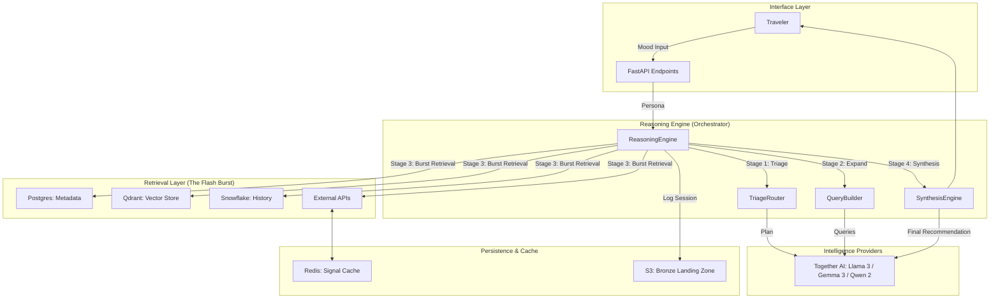

# ChaloGhumo System Architecture

## 1. High-Level Overview

ChaloGhumo is a high-performance RAG (Retrieval-Augmented Generation) reasoning engine designed for travel discovery. It utilizes a multi-stage cognitive pipeline to transform vague user moods into validated, expert-grade travel recommendations.

## 2. System Architecture Diagram

## 3. Core Objects & Functionality

| Object | Functionality | Relationship |
| :--- | :--- | :--- |
| **`TriageRouter`** | Analyzes user mood and selects necessary signals. | Uses Qwen-2 1.5B via Together AI. |
| **`QueryBuilder`** | Generates SQL, Vector, and API specifications. | Uses Gemma-3 4B via Together AI. |
| **`ReasoningEngine`** | Orchestrates the end-to-end parallel retrieval and synthesis. | The central hub; interacts with all services. |
| **`SignalService`** | Fetches and caches real-time environmental/societal data. | Interfaces with OpenWeather, Ticketmaster, and Redis. |
| **`SnowflakeService`** | Provides historical validation and vibe stability scores. | Queries the Gold Analytical layer. |
| **`VectorService`** | Performs semantic similarity search for 'vibes'. | Interfaces with Qdrant and SentenceTransformers. |

## 4. Data Flow (Sub-2s Latency Path)

1. **Ingest**: User sends mood (e.g., "I want a quiet, snowy escape").
2. **Analyze**: `TriageRouter` identifies that "Weather" and "Historical Trends" are critical.
3. **Expand**: `QueryBuilder` creates a snow-focused vector query and a budget-filtered SQL query.
4. **Burst**: All 4 data sources are queried in parallel via `asyncio.gather`.
5. **Fuse**: `ReasoningEngine` ranks candidates by intersecting Vector scores with Postgres constraints.
6. **Synthesize**: Llama-3 70B produces the final poetic reasoning chain.

---
**Status**: Production Architecture Documented.
