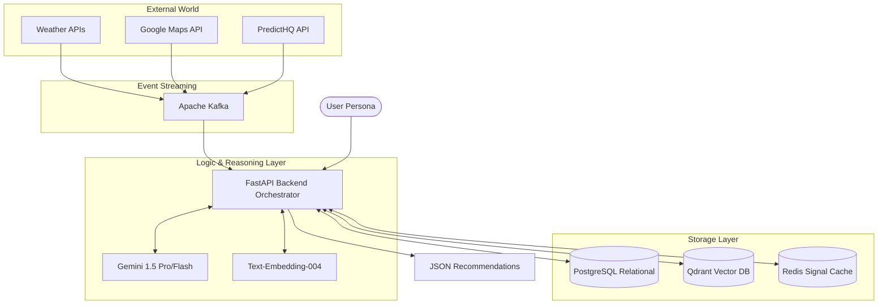

# Technical Stack & Database Architecture

This document defines the technological choices and architectural components for the ChaloGhumo "Understanding Engine," focusing on a decoupled, API-driven backend architecture.

## Architecture Overview

## 1. Core Logic & API Framework

| Component | Choice | Rationale |
| :--- | :--- | :--- |
| **Backend API** | **FastAPI (Python 3.11+)** | High performance, native support for asynchronous operations, and best-in-class integration with AI ecosystems. |
| **Schema Definition** | **Pydantic V2** | Enforces strict JSON-based request/response schemas, ensuring data integrity and automatic API documentation. |
| **Runtime** | **Uvicorn / Gunicorn** | High-concurrency ASGI server implementation for production-grade stability. |

## 2. Database & Information Architecture

The system utilizes a specialized storage layer for relational metadata, high-dimensional semantic search, and real-time signals.

### A. Relational Store: **PostgreSQL**

- **Purpose**: Durable storage for destination metadata, user profiles, and historical `UserPersona` records.
- **Constraint Logic**: Handles complex `HardConstraint` filtering and transactional integrity.

### B. Vector Memory (Contextual Embeddings): **Qdrant**

- **Purpose**: High-performance similarity search for semantic "Vibes" and user "Moods."
- **Function**: Stores and retrieves text-based contextual embeddings generated by the LLM (Text-Embedding-004).
- **Features**: Payload filtering, high-concurrency search, and seamless FastAPI integration.

### C. High-Velocity Signal Cache: **Redis**

- **Purpose**: Implements the **Entropy Management** strategy for real-time data.
- **Features**:
  - **TTL (Time To Live)**: Automatically manages the 15-minute half-life for high-velocity signals (Weather, Crowds).
  - **Persistence**: Periodic RDB snapshots for state recovery.
  - **Rate Limiting**: Protects downstream Signal Sources (APIs) from ingestion spikes.

### D. Message Broker (Optional): **Apache Kafka**

- For asynchronous signal ingestion, event streaming, and background revalidation tasks when signal confidence drops below thresholds.

## 3. LLM Orchestration & Model Selection

ChaloGhumo utilizes a multi-model approach to balance reasoning depth with execution speed, orchestrated via the Python `google-generativeai` or `vertexai` SDKs.

| Model | Role | Function |
| :--- | :--- | :--- |
| **Gemini 1.5 Pro** | **The Cognitive Core** | Complex synthesis, generating the `ReasoningChain`, and final recommendation narration. |
| **Gemini 1.5 Flash** | **Signal Processor** | High-velocity entity extraction, initial scoring, and sanity-checking `ContextSnapshots`. |
| **Text-Embedding-004** | **Semantic Bridge** | Vectorizing destination "Vibes" and user "Moods" for high-dimensional similarity matching. |

## 4. Signal Ingestion & External APIs

The FastAPI backend interacts with external sources to maintain the **Environmental & Societal Domains**:

- **Weather & Climate**: OpenWeatherMap / Tomorrow.io (Real-time precipitation, temperature trends).
- **Geospatial**: Google Maps Places API (Infrastructure availability, operating hours).
- **Societal/Events**: PredictHQ (Local festivals, public holidays, crowd density predictions).
- **Sustainability**: Custom scraping modules for monitoring over-tourism indicators.

## 5. Deployment & Infrastructure

- **Containerization**: Docker for environment consistency across local and production.
- **Orchestration**: Google Cloud Run for serverless auto-scaling based on request volume.
- **CI/CD**: GitHub Actions for automated linting (Pylint/Flake8) and deployment.
- **Monitoring**: OpenTelemetry + Sentry for tracking reasoning engine latency and signal decay events.
