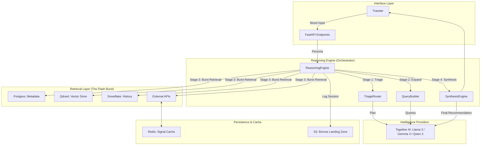

# ChaloGhumo: Complete Build Guide
## From First Principles to Production-Grade Deployment

---

## Part 0 — Repository Summary

**ChaloGhumo** ("Let's Wander" in Hindi) is an AI-powered travel recommendation engine built on a multi-stage RAG (Retrieval-Augmented Generation) pipeline. Instead of filter-based search, it accepts a natural-language "mood" or "vibe" from a user and synthesises a destination recommendation by combining:

- **Semantic vector search** (Qdrant) to match vibes
- **Relational constraint filtering** (PostgreSQL) for hard rules
- **Real-time signal enrichment** (Redis-cached weather, safety, events from external APIs)
- **Multi-model LLM pipeline** (Together AI — Qwen 1.5B for triage → Gemma 4B for query building → Llama 3 70B for final synthesis)
- **Event streaming** (Kafka) for high-velocity signals like crowd density
- **Analytics warehouse** (Snowflake, medallion architecture) for historical trend data

The codebase is a FastAPI Python 3.11 monolith with clean layering: `api/` → `services/` → `core/`, Alembic migrations, Docker Compose for local dev, GitHub Actions CI, and Terraform for Snowflake IaC. Key gaps that remain: no authentication/authorisation, no internationalisation, no multi-tenancy, and the deployment target is only partially defined (Terraform only covers Snowflake, not the application itself).

**Stack at a glance:**

| Layer | Technology |
|---|---|
| API | FastAPI + Uvicorn |
| LLM | Together AI (Qwen, Gemma, Llama 3) |
| Embeddings | sentence-transformers (all-MiniLM-L6-v2) |
| Vector DB | Qdrant |
| Relational DB | PostgreSQL 15 + SQLAlchemy + Alembic |
| Cache / Rate-limit | Redis 7 |
| Event streaming | Apache Kafka (Confluent) |
| Analytics | Snowflake (Bronze/Silver/Gold medallion) |
| IaC | Terraform (Snowflake provider) |
| CI | GitHub Actions |
| Containerisation | Docker + Docker Compose |

---

## Part 0.1 — System Architecture



---


## Part 1 — Problem Statement & First Principles

### 1.1 The Problem

Existing travel platforms (Booking, Expedia, Skyscanner) are **filter engines**: they help users who already know what they want. They cannot answer "I need a place that matches my current energy — craving solitude but also some vibrant chaos" because that input is semantically rich and emotionally grounded, not a set of checkboxes.

A system that understands **intent expressed in natural language**, combines it with **live contextual signals** (weather, safety, events), and produces **transparent reasoning** rather than opaque rankings is genuinely differentiated.

### 1.2 First Principles

**What is a recommendation?** A function: `f(user_state, world_state) → ranked_destinations`.

- `user_state` = preferences (weights), constraints (hard rules), mood (semantic)
- `world_state` = weather, safety, crowd density, events, flight availability, historical trends
- `ranked_destinations` = destinations with a scored match and an explainable reasoning chain

**Why RAG and not fine-tuning?** World state changes in real time; a fine-tuned model's knowledge is frozen. RAG lets you inject live context at inference time without retraining.

**Why multi-model?** Cost and latency trade-offs. Use a tiny model (1–4B) for structured extraction and a large model (70B) only for final synthesis — this yields sub-2s response times at acceptable cost.

**Why dual databases (Postgres + Qdrant)?** Relational DBs enforce hard constraints (budget, wheelchair access) cheaply; vector DBs find semantic similarity cheaply. Neither does the other's job well.

---

## Part 2 — Project Initialisation

### 2.1 Toolchain Prerequisites

```bash
# Python 3.11+
pyenv install 3.11.9 && pyenv local 3.11.9

# Dependency management
pip install uv          # faster than pip/poetry

# Infrastructure tooling
brew install terraform
brew install docker

# Code quality
pip install ruff mypy pytest pytest-asyncio
```

### 2.2 Project Scaffold

```
chaloghumo/
├── api/
│   └── v1/
│       ├── api.py              # Router aggregation
│       └── endpoints/          # One file per resource
├── core/
│   ├── config.py               # Pydantic Settings
│   ├── database.py             # SQLAlchemy engine + session
│   ├── middleware.py           # Rate limiting, logging, tracing
│   └── security.py             # Auth helpers, input sanitisation
├── models/                     # SQLAlchemy ORM models
├── schemas/                    # Pydantic I/O schemas
├── services/
│   ├── llm.py                  # LLM + embedding wrapper
│   ├── vector_store.py         # Qdrant wrapper
│   ├── signals.py              # Redis signal cache
│   ├── reasoning.py            # RAG orchestrator
│   ├── query_builder.py        # LLM-powered query synthesis
│   ├── kafka_consumer.py       # Async event consumer
│   └── external_apis/          # Weather, safety, events, travel
├── alembic/                    # DB migration scripts
├── terraform/                  # IaC
├── tests/
├── scripts/                    # Seed, init, optimise
├── docs/
├── .github/workflows/
├── Dockerfile
├── docker-compose.yml
├── pyproject.toml
├── requirements.txt
└── main.py
```

### 2.3 Dependency Pinning

Use `pyproject.toml` with `uv` for reproducible installs:

```toml
[project]
name = "chaloghumo"
version = "0.1.0"
requires-python = ">=3.11"
dependencies = [
    "fastapi>=0.111",
    "uvicorn[standard]>=0.30",
    "pydantic>=2.7",
    "pydantic-settings>=2.3",
    "sqlalchemy>=2.0",
    "psycopg2-binary>=2.9",
    "alembic>=1.13",
    "qdrant-client>=1.9",
    "redis>=5.0",
    "aiokafka>=0.11",
    "sentence-transformers>=3.0",
    "together>=1.0",
    "httpx>=0.27",
    "python-dotenv>=1.0",
    "python-jose[cryptography]>=3.3",    # JWT
    "passlib[bcrypt]>=1.7",              # Password hashing
    "babel>=2.15",                        # i18n
]
```

---

## Part 3 — Database Design

### 3.1 PostgreSQL — Relational Layer

**Design decisions:**
- UUIDs as primary keys (prevents enumeration attacks, works across distributed inserts)
- `region_type` as a Postgres ENUM (enforced at DB level, not just application level)
- `dynamic_state` as JSONB (not JSON) — JSONB is indexed and queryable
- `updated_at` trigger via SQLAlchemy `onupdate`

**Core tables:**

```sql
-- destinations: static/semi-static data
CREATE TABLE destinations (
    id          UUID PRIMARY KEY DEFAULT gen_random_uuid(),
    name        VARCHAR NOT NULL,
    lat         FLOAT NOT NULL,
    lng         FLOAT NOT NULL,
    elevation   FLOAT,
    region_type regiontype NOT NULL,
    base_vibe   JSONB NOT NULL DEFAULT '[]',
    dynamic_state JSONB DEFAULT '{}',
    created_at  TIMESTAMPTZ DEFAULT now(),
    updated_at  TIMESTAMPTZ
);
CREATE INDEX idx_destinations_name ON destinations(name);
CREATE INDEX idx_destinations_region ON destinations(region_type);
CREATE INDEX idx_destinations_vibe ON destinations USING GIN(base_vibe);

-- users: auth + preference storage
CREATE TABLE users (
    id            UUID PRIMARY KEY DEFAULT gen_random_uuid(),
    email         VARCHAR UNIQUE NOT NULL,
    username      VARCHAR UNIQUE NOT NULL,
    hashed_password VARCHAR NOT NULL,
    is_active     BOOLEAN DEFAULT true,
    is_superuser  BOOLEAN DEFAULT false,
    preferred_locale VARCHAR DEFAULT 'en',
    preferences   JSONB NOT NULL DEFAULT '{}',
    constraints   JSONB NOT NULL DEFAULT '[]',
    mood          VARCHAR,
    created_at    TIMESTAMPTZ DEFAULT now(),
    updated_at    TIMESTAMPTZ
);

-- recommendation_history: audit trail
CREATE TABLE recommendation_history (
    id               UUID PRIMARY KEY DEFAULT gen_random_uuid(),
    user_id          UUID REFERENCES users(id) ON DELETE CASCADE,
    destination_id   UUID REFERENCES destinations(id),
    match_score      FLOAT,
    reasoning_chain  JSONB,
    context_snapshot JSONB,
    created_at       TIMESTAMPTZ DEFAULT now()
);
```

### 3.2 Alembic Migrations

Always use Alembic — never `Base.metadata.create_all()` in production.

```bash
alembic init alembic
alembic revision --autogenerate -m "initial_schema"
alembic upgrade head
```

**env.py pattern** — import all models so autogenerate detects them:

```python
# alembic/env.py
from models.destination import Destination  # noqa: F401
from models.user import User                # noqa: F401
from core.database import Base
target_metadata = Base.metadata
```

### 3.3 Qdrant — Vector Layer

Vector collection configuration:

```python
client.create_collection(
    collection_name="destinations",
    vectors_config=models.VectorParams(
        size=384,                      # all-MiniLM-L6-v2 output dim
        distance=models.Distance.COSINE
    ),
    hnsw_config=models.HnswConfigDiff(
        m=32,                          # higher = better recall, more RAM
        ef_construct=128,              # higher = better index quality
        full_scan_threshold=10_000
    ),
    optimizers_config=models.OptimizersConfigDiff(
        indexing_threshold=20_000      # batch index after 20k vectors
    )
)
```

**Payload schema enforcement:** Validate every payload with a Pydantic model before upserting — prevents schema drift between Postgres and Qdrant.

### 3.4 Snowflake — Analytics Warehouse (Medallion Architecture)

```
RAW_BRONZE  → raw ingested events, never mutated
CLEAN_SILVER → deduplicated, typed, enriched
ANALYTICS_GOLD → aggregated, business-ready (trends, heatmaps)
```

Use Terraform (as the repo does) to provision all Snowflake resources — never click through the UI for production objects.

---

## Part 4 — Core API Layer

### 4.1 Settings Management

All secrets via environment variables, never hardcoded:

```python
# core/config.py
class Settings(BaseSettings):
    # API
    API_V1_STR: str = "/api/v1"
    PROJECT_NAME: str = "ChaloGhumo"
    VERSION: str = "0.1.0"
    DEBUG: bool = False
    
    # Security
    SECRET_KEY: str                           # 64-byte random hex
    ACCESS_TOKEN_EXPIRE_MINUTES: int = 30
    REFRESH_TOKEN_EXPIRE_DAYS: int = 7
    ALGORITHM: str = "HS256"
    
    # CORS — explicit list, never "*" in production
    BACKEND_CORS_ORIGINS: List[AnyHttpUrl] = []
    
    # All infrastructure credentials...
    
    class Config:
        env_file = ".env"
        case_sensitive = True
```

Generate `SECRET_KEY` with: `openssl rand -hex 64`

### 4.2 API Versioning

Structure routes under `/api/v1/` from day one. When breaking changes are needed, add `/api/v2/` alongside — never mutate existing versioned routes.

```python
# api/v1/api.py
from fastapi import APIRouter
from api.v1.endpoints import health, recommendations, auth, destinations

api_router = APIRouter()
api_router.include_router(health.router, prefix="/health", tags=["health"])
api_router.include_router(auth.router, prefix="/auth", tags=["auth"])
api_router.include_router(recommendations.router, prefix="/recommendations", tags=["recommendations"])
api_router.include_router(destinations.router, prefix="/destinations", tags=["destinations"])
```

### 4.3 Global Exception Handling

```python
# main.py pattern from the repo — extend it:
@app.exception_handler(HTTPException)
async def http_exception_handler(request, exc):
    return JSONResponse(status_code=exc.status_code, content={
        "error_type": "HTTPError",
        "status_code": exc.status_code,
        "message": exc.detail,
        "request_id": request.state.request_id  # from tracing middleware
    })
```

---

## Part 5 — Authentication & Authorisation

This is the largest gap in the current repo. Here is the complete pattern.

### 5.1 Authentication (Who are you?)

Use **JWT Bearer tokens** with a short-lived access token + long-lived refresh token pattern.

```python
# core/security.py
from datetime import datetime, timedelta
from jose import jwt, JWTError
from passlib.context import CryptContext

pwd_context = CryptContext(schemes=["bcrypt"], deprecated="auto")

def hash_password(password: str) -> str:
    return pwd_context.hash(password)

def verify_password(plain: str, hashed: str) -> bool:
    return pwd_context.verify(plain, hashed)

def create_access_token(subject: str, expires_delta: timedelta) -> str:
    expire = datetime.utcnow() + expires_delta
    return jwt.encode(
        {"sub": subject, "exp": expire, "type": "access"},
        settings.SECRET_KEY,
        algorithm=settings.ALGORITHM
    )

def create_refresh_token(subject: str) -> str:
    expire = datetime.utcnow() + timedelta(days=settings.REFRESH_TOKEN_EXPIRE_DAYS)
    return jwt.encode(
        {"sub": subject, "exp": expire, "type": "refresh"},
        settings.SECRET_KEY,
        algorithm=settings.ALGORITHM
    )
```

**Auth endpoints:**

```
POST /api/v1/auth/register   → create user, return tokens
POST /api/v1/auth/login      → verify credentials, return tokens
POST /api/v1/auth/refresh    → exchange refresh token for new access token
POST /api/v1/auth/logout     → blacklist refresh token in Redis
```

**Dependency injection for protected routes:**

```python
# core/deps.py
from fastapi import Depends, HTTPException, status
from fastapi.security import OAuth2PasswordBearer

oauth2_scheme = OAuth2PasswordBearer(tokenUrl="/api/v1/auth/login")

async def get_current_user(token: str = Depends(oauth2_scheme), db=Depends(get_db)):
    credentials_exception = HTTPException(
        status_code=status.HTTP_401_UNAUTHORIZED,
        detail="Could not validate credentials",
        headers={"WWW-Authenticate": "Bearer"},
    )
    try:
        payload = jwt.decode(token, settings.SECRET_KEY, algorithms=[settings.ALGORITHM])
        user_id: str = payload.get("sub")
        if user_id is None or payload.get("type") != "access":
            raise credentials_exception
    except JWTError:
        raise credentials_exception
    user = await get_user_by_id(db, user_id)
    if not user:
        raise credentials_exception
    return user

async def get_current_active_user(current_user = Depends(get_current_user)):
    if not current_user.is_active:
        raise HTTPException(status_code=400, detail="Inactive user")
    return current_user
```

### 5.2 Authorisation (What can you do?)

Use **RBAC (Role-Based Access Control)** with roles stored in the users table:

```python
# Roles: user, moderator, admin
def require_role(*roles: str):
    async def role_checker(current_user = Depends(get_current_active_user)):
        if current_user.role not in roles:
            raise HTTPException(status_code=403, detail="Insufficient permissions")
        return current_user
    return role_checker

# Usage:
@router.delete("/{dest_id}", dependencies=[Depends(require_role("admin"))])
async def delete_destination(dest_id: str): ...
```

### 5.3 Policy Layer

For fine-grained access control beyond roles (e.g. "users can only delete their own recommendation history"), implement a lightweight policy layer:

```python
# core/policies.py
class RecommendationPolicy:
    @staticmethod
    def can_delete(current_user, record) -> bool:
        return current_user.is_superuser or record.user_id == current_user.id

# Usage in endpoint:
if not RecommendationPolicy.can_delete(current_user, record):
    raise HTTPException(status_code=403, detail="Not allowed")
```

For complex scenarios at scale, consider **OPA (Open Policy Agent)** as a sidecar.

### 5.4 API Key Auth (for service-to-service)

Internal services (Kafka consumer, seeder scripts) should use API keys, not JWTs:

```python
API_KEY_HEADER = APIKeyHeader(name="X-API-Key", auto_error=False)

async def verify_api_key(api_key: str = Depends(API_KEY_HEADER)):
    if api_key != settings.INTERNAL_API_KEY:
        raise HTTPException(status_code=403, detail="Invalid API key")
```

---

## Part 6 — Security

### 6.1 Input Validation & Sanitisation

The repo has a good start with `core/security.py` (filename sanitisation) and injection pattern detection in middleware. Extend this:

- **SQL Injection**: SQLAlchemy ORM with parameterised queries — never string-format SQL. The LLM-generated SQL in `query_builder.py` is a risk; always validate it against a whitelist of allowed patterns before execution.
- **Prompt Injection**: The repo sanitises LLM outputs (`_sanitize` in `llm.py`). Also sanitise **inputs** before they reach the LLM prompt.
- **XSS**: FastAPI returns JSON, not HTML, so XSS risk is low — but sanitise any fields that could be rendered downstream.
- **SSRF**: When fetching external APIs, validate URLs against an allowlist.

### 6.2 Rate Limiting

The repo uses Redis-backed rate limiting. In production, also add:

- Per-user rate limits (authenticated users get higher limits)
- Endpoint-specific limits (LLM endpoints are expensive — tighter limits)
- Global burst protection at the load balancer (AWS WAF / GCP Cloud Armor)

### 6.3 Secrets Management

Never commit secrets to git. Use:
- **Local dev**: `.env` file (git-ignored)
- **CI**: GitHub Actions Secrets
- **Production**: AWS Secrets Manager / GCP Secret Manager / HashiCorp Vault

```python
# In production, pull from AWS SSM:
import boto3
ssm = boto3.client('ssm')
secret = ssm.get_parameter(Name='/chaloghumo/prod/together-api-key', WithDecryption=True)
```

### 6.4 HTTPS & Transport Security

- **Never** run HTTP in production — terminate TLS at the load balancer
- Set security headers via middleware:

```python
from starlette.middleware.httpsredirect import HTTPSRedirectMiddleware

app.add_middleware(HTTPSRedirectMiddleware)  # Redirect HTTP → HTTPS

# Security headers
@app.middleware("http")
async def security_headers(request, call_next):
    response = await call_next(request)
    response.headers["X-Content-Type-Options"] = "nosniff"
    response.headers["X-Frame-Options"] = "DENY"
    response.headers["Strict-Transport-Security"] = "max-age=63072000; includeSubDomains"
    response.headers["Content-Security-Policy"] = "default-src 'self'"
    return response
```

### 6.5 Dependency Scanning

```yaml
# .github/workflows/security.yml
- name: Scan dependencies
  uses: pypa/gh-action-pip-audit@v1
  with:
    inputs: requirements.txt

- name: Container scan
  uses: aquasecurity/trivy-action@master
  with:
    image-ref: chaloghumo:latest
```

---

## Part 7 — Internationalisation (i18n)

The repo has a `preferred_locale` field in the user schema but no i18n implementation. Here is the complete pattern:

### 7.1 Message Catalogue

Use **Babel** + GNU gettext `.po` files:

```
locales/
├── en/LC_MESSAGES/messages.po
├── hi/LC_MESSAGES/messages.po
├── fr/LC_MESSAGES/messages.po
└── messages.pot  # template
```

```bash
# Extract strings
pybabel extract -F babel.cfg -o locales/messages.pot .
# Initialise a new locale
pybabel init -i locales/messages.pot -d locales -l hi
# Compile
pybabel compile -d locales
```

### 7.2 Locale Detection Middleware

```python
# core/i18n.py
from babel import Locale
from babel.support import Translations

def get_translations(locale_str: str) -> Translations:
    locale = Locale.parse(locale_str, sep='-')
    return Translations.load('locales', [locale])

@app.middleware("http")
async def locale_middleware(request: Request, call_next):
    accept_language = request.headers.get("Accept-Language", "en")
    locale = parse_accept_language(accept_language)  # pick best match
    request.state.locale = locale
    request.state.gettext = get_translations(locale).gettext
    return await call_next(request)
```

### 7.3 LLM Response Localisation

For AI-generated reasoning chains, pass the locale to the synthesis prompt:

```python
prompt = f"""
...
Respond in {persona.preferred_locale} language.
Use culturally appropriate references for a {persona.preferred_locale} audience.
...
"""
```

---

## Part 8 — The RAG Pipeline (Deep Dive)

### 8.1 Four-Stage Architecture

```
User Request (UserPersona)
        │
        ▼
┌─────────────────────────────┐
│  Stage 1: TRIAGE            │  Qwen 1.5B — fast, cheap
│  Intent analysis            │  Outputs: search_terms, constraints,
│  Query expansion            │  signal_requirements
└────────────┬────────────────┘
             │
             ▼
┌─────────────────────────────┐
│  Stage 2: QUERY BUILDING    │  Gemma 4B — structured output
│  SQL generation             │  Outputs: postgres_sql,
│  Qdrant filter spec         │  qdrant_params, api_specs
│  API specs                  │
└────────────┬────────────────┘
             │
             ▼
┌─────────────────────────────┐
│  Stage 3: PARALLEL BURST    │  asyncio.gather()
│  Postgres fetch             │  All 4 sources hit simultaneously
│  Qdrant semantic search     │  Target: <500ms total
│  Signal fetch (Redis/APIs)  │
│  Snowflake trends           │
└────────────┬────────────────┘
             │
             ▼
┌─────────────────────────────┐
│  Stage 4: SYNTHESIS         │  Llama 3 70B — expensive, high quality
│  Merge + rank candidates    │  Outputs: reasoning_chain[]
│  Generate reasoning chain   │  with domain, impact_weight
│  Return structured response │
└─────────────────────────────┘
```

### 8.2 Embedding Strategy

**Local embeddings** (all-MiniLM-L6-v2) for latency and cost — 384 dimensions, ~22ms on CPU. Wrap in a connection pool to avoid loading the model per request:

```python
class IntelligenceService:
    def __init__(self):
        # Loaded once at startup, shared across all requests
        self.embedding_model = SentenceTransformer('all-MiniLM-L6-v2')
        self._embed_lock = asyncio.Lock()  # prevent concurrent model load races
```

For higher quality at the cost of latency, upgrade to `all-mpnet-base-v2` (768 dims) or use a hosted API (OpenAI text-embedding-3-small).

### 8.3 LLM-Generated SQL Safety

The `query_builder.py` uses an LLM to generate SQL — this is powerful but dangerous. Safeguards:

```python
import sqlparse
import re

SAFE_SQL_PATTERN = re.compile(
    r'^SELECT\s+[\w\s,\*\.]+\s+FROM\s+destinations\b',
    re.IGNORECASE
)

def validate_llm_sql(sql: str) -> str:
    """Ensure LLM-generated SQL is safe before execution."""
    parsed = sqlparse.parse(sql.strip())[0]
    if parsed.get_type() != 'SELECT':
        raise ValueError("Only SELECT statements are allowed")
    if not SAFE_SQL_PATTERN.match(sql.strip()):
        raise ValueError("SQL does not target destinations table")
    forbidden = ['DROP', 'DELETE', 'INSERT', 'UPDATE', 'TRUNCATE', '--', ';--']
    for keyword in forbidden:
        if keyword.lower() in sql.lower():
            raise ValueError(f"Forbidden keyword: {keyword}")
    return sql
```

---

## Part 9 — Signal Architecture (Redis + Kafka)

### 9.1 Redis Signal Caching

TTL strategy by signal velocity:

| Signal Type | TTL | Rationale |
|---|---|---|
| Weather | 3600s (1hr) | Changes slowly |
| Safety index | 86400s (1day) | Very slow change |
| Events | 21600s (6hr) | Semi-live |
| Crowd density | 300s (5min) | High velocity |
| Emergency alerts | 3600s (1hr) | Must persist |
| Rate limit counters | 60s (1min) | Sliding window |

### 9.2 Kafka Topic Design

```
destination_signals       ← crowd density, emergencies (high velocity)
destination_enrichment    ← new events, attraction updates (medium velocity)
user_events               ← search, click, booking signals (for ML feedback)
recommendation_audit      ← every recommendation for compliance/replay
```

**Consumer group pattern:**
- `signal_ingestion_group` — updates Redis (the repo's current consumer)
- `analytics_group` — writes to Snowflake Bronze layer
- `ml_feedback_group` — trains/updates ranking models

### 9.3 Dead Letter Queue

Always handle consumer failures:

```python
async def process_signal(self, data: dict):
    try:
        await self._process(data)
    except Exception as e:
        # Send to DLQ topic for manual inspection
        await self._send_to_dlq(data, error=str(e))
        # Don't re-raise — prevents consumer crash loop
```

---

## Part 10 — DevOps & CI/CD

### 10.1 GitHub Actions Pipeline

```yaml
# .github/workflows/ci.yml — extend from the repo:
name: CI/CD Pipeline

on:
  push:
    branches: [main, develop]
  pull_request:
    branches: [main]

jobs:
  quality:
    runs-on: ubuntu-latest
    steps:
      - uses: actions/checkout@v4
      - uses: actions/setup-python@v5
        with: { python-version: '3.11', cache: 'pip' }
      - run: pip install ruff mypy bandit
      - run: ruff check .            # linting
      - run: mypy . --strict         # type safety
      - run: bandit -r . -ll         # security scan

  test:
    runs-on: ubuntu-latest
    services:
      postgres: { image: postgres:15-alpine, ... }
      redis: { image: redis:7-alpine, ... }
      qdrant: { image: qdrant/qdrant:latest, ... }
    steps:
      - run: pytest tests/ --cov=. --cov-report=xml
      - uses: codecov/codecov-action@v4

  build:
    needs: [quality, test]
    runs-on: ubuntu-latest
    steps:
      - uses: docker/build-push-action@v5
        with:
          push: ${{ github.ref == 'refs/heads/main' }}
          tags: ghcr.io/org/chaloghumo:${{ github.sha }}

  deploy-staging:
    needs: build
    if: github.ref == 'refs/heads/main'
    environment: staging
    steps:
      - run: # deploy to staging cluster

  deploy-production:
    needs: deploy-staging
    environment: production     # requires manual approval
    steps:
      - run: # deploy to production cluster
```

### 10.2 Dockerfile

```dockerfile
# Multi-stage build — keep production image small
FROM python:3.11-slim AS builder
WORKDIR /build
COPY requirements.txt .
RUN pip install --no-cache-dir --prefix=/install -r requirements.txt

FROM python:3.11-slim AS production
WORKDIR /app

# Non-root user
RUN addgroup --system appgroup && adduser --system --group appuser
USER appuser

COPY --from=builder /install /usr/local
COPY --chown=appuser:appgroup . .

# Health check
HEALTHCHECK --interval=30s --timeout=3s \
  CMD curl -f http://localhost:8000/api/v1/health || exit 1

EXPOSE 8000
CMD ["uvicorn", "main:app", "--host", "0.0.0.0", "--port", "8000", "--workers", "4"]
```

---

## Part 11 — Cloud Deployment

### 11.1 Recommended Architecture (AWS)

```
Internet
    │
    ▼
[CloudFront CDN]
    │
    ▼
[Application Load Balancer]  ← SSL termination, WAF
    │
    ├──► [ECS Fargate — FastAPI]   (auto-scales)
    │         │
    │    [RDS Aurora Postgres]     (Multi-AZ)
    │    [ElastiCache Redis]       (Multi-AZ)
    │    [MSK Kafka]               (Managed)
    │    [Qdrant — EC2/ECS]        (or Qdrant Cloud)
    │
    └──► [Snowflake]               (external warehouse)
```

**Alternatively on GCP** (closer to the arch docs' intent):
- Cloud Run (FastAPI — serverless, scales to zero)
- Cloud SQL (Postgres)
- Memorystore (Redis)
- Pub/Sub (replace Kafka for simpler setups)
- Qdrant Cloud or self-hosted on GKE

### 11.2 Terraform Structure (extend the repo)

```hcl
# terraform/
# ├── main.tf          (providers, backend)
# ├── vpc.tf           (network)
# ├── ecs.tf           (application)
# ├── rds.tf           (database)
# ├── elasticache.tf   (redis)
# ├── msk.tf           (kafka)
# ├── snowflake.tf     (already in repo)
# ├── variables.tf
# └── outputs.tf

# Remote state — never local in production
terraform {
  backend "s3" {
    bucket = "chaloghumo-tfstate"
    key    = "prod/terraform.tfstate"
    region = "ap-south-1"
    encrypt = true
    dynamodb_table = "chaloghumo-tfstate-lock"
  }
}
```

### 11.3 Environment Strategy

| Environment | Purpose | Data |
|---|---|---|
| `local` | Development, Docker Compose | Seeded test data |
| `staging` | Pre-production testing | Anonymised prod copy |
| `production` | Live system | Real data, PII protected |

---

## Part 12 — Observability

### 12.1 Structured Logging

Replace `print()` statements (the repo uses these extensively) with structured logging:

```python
import structlog

logger = structlog.get_logger()

# Usage:
logger.info("recommendation.generated",
    destination_id=dest_id,
    match_score=score,
    latency_ms=elapsed,
    user_id=user.id
)
```

### 12.2 Distributed Tracing

Add OpenTelemetry for end-to-end request tracing across all services:

```python
from opentelemetry import trace
from opentelemetry.instrumentation.fastapi import FastAPIInstrumentor
from opentelemetry.instrumentation.sqlalchemy import SQLAlchemyInstrumentor

FastAPIInstrumentor.instrument_app(app)
SQLAlchemyInstrumentor().instrument()
```

Send traces to **Jaeger** (self-hosted) or **Honeycomb** / **Datadog** (managed).

### 12.3 Metrics

Key metrics to track:

- `recommendation_latency_p99` (target: <2000ms)
- `llm_call_duration_by_model` (identify slow models)
- `vector_search_latency` (target: <100ms)
- `signal_cache_hit_rate` (target: >90%)
- `error_rate_by_endpoint`
- `kafka_consumer_lag`

Use **Prometheus** + **Grafana**, or a managed solution like Datadog.

### 12.4 Alerting

Critical alerts:
- Error rate > 1% for 5 minutes → PagerDuty
- P99 latency > 5s → Slack warning
- Kafka consumer lag > 10,000 messages → immediate alert
- LLM API key quota near exhaustion → Slack warning

---

## Part 13 — Testing Strategy

### 13.1 Test Pyramid

```
         /\
        /E2E\       ← 5%  (full stack, slow)
       /──────\
      / Integ  \    ← 20% (DB + Redis + Qdrant real)
     /──────────\
    /    Unit    \  ← 75% (mocked dependencies, fast)
   /______________\
```

### 13.2 Unit Tests

Mock external services:

```python
# tests/test_reasoning.py
import pytest
from unittest.mock import AsyncMock, patch

@pytest.mark.asyncio
async def test_generate_recommendation_success():
    with patch('services.reasoning.vector_service.search_by_vibe', new_callable=AsyncMock) as mock_search, \
         patch('services.reasoning.intelligence_service.get_reasoning', new_callable=AsyncMock) as mock_llm:
        
        mock_search.return_value = [{"id": "dest-1", "score": 0.9, "payload": {"name": "Goa"}}]
        mock_llm.return_value = '[{"step_id": 1, "logic": "Matches mood", "domain": "Persona", "impact_weight": 0.8}]'
        
        result = await reasoning_engine.generate_recommendation(mock_persona)
        assert result["match_score"] == 0.9
        assert result["destination_name"] == "Goa"
```

### 13.3 Integration Tests

Use `testcontainers` for real DB tests:

```python
from testcontainers.postgres import PostgresContainer

@pytest.fixture(scope="session")
def postgres_container():
    with PostgresContainer("postgres:15-alpine") as pg:
        yield pg.get_connection_url()
```

### 13.4 Load Testing

Use **Locust** to validate the sub-2s SLA:

```python
# locustfile.py
from locust import HttpUser, task

class TravelUser(HttpUser):
    @task
    def get_recommendation(self):
        self.client.post("/api/v1/recommendations/", json={
            "preferences": {"adventure": 0.8},
            "constraints": ["max_budget: 2000"],
            "mood": "vibrant city energy"
        })
```

Target: 100 RPS with P99 < 2000ms.

---

## Part 14 — Versioning & Release Management

### 14.1 Semantic Versioning

Follow `MAJOR.MINOR.PATCH`:
- MAJOR: breaking API changes
- MINOR: new features, backwards compatible
- PATCH: bug fixes

Automate with **semantic-release** in CI based on conventional commits:
- `feat:` → MINOR
- `fix:` → PATCH
- `feat!:` or `BREAKING CHANGE:` → MAJOR

### 14.2 API Deprecation Policy

1. Announce deprecation in API response headers: `Sunset: Sat, 01 Jan 2027 00:00:00 GMT`
2. Run v1 and v2 in parallel for at least 6 months
3. Document migration path in changelog
4. Send deprecation notices to registered developers

### 14.3 Database Migration Safety

For zero-downtime migrations:
1. **Expand**: add new columns/tables (backwards compatible)
2. **Migrate**: backfill data
3. **Contract**: remove old columns (in a separate deployment, after old code is gone)

Never do both in a single Alembic migration.

---

## Part 15 — Production Readiness Checklist

Before going live, verify each of these:

**Security**
- [ ] All secrets in secrets manager, not in code or env files committed to git
- [ ] HTTPS enforced, HSTS headers set
- [ ] Rate limiting active per-user and per-IP
- [ ] LLM-generated SQL validated before execution
- [ ] Prompt injection detection in middleware
- [ ] Dependency CVE scan in CI
- [ ] Container image scanned (Trivy)
- [ ] JWT tokens short-lived (≤30 min access, ≤7 day refresh)

**Reliability**
- [ ] Health check endpoint returns 200 only when all dependencies are ready
- [ ] Graceful shutdown handles in-flight requests
- [ ] Retry logic with exponential backoff on all external API calls
- [ ] Circuit breaker on LLM calls (fallback to cached/default response)
- [ ] Kafka DLQ configured

**Performance**
- [ ] asyncio.gather() used for all parallel I/O (the repo does this correctly)
- [ ] Embedding model loaded once at startup, not per request
- [ ] Redis cache hit rate monitored and optimised
- [ ] Database connection pooling configured (SQLAlchemy pool_size=10, max_overflow=20)
- [ ] Qdrant HNSW index tuned for collection size

**Observability**
- [ ] Structured JSON logs shipped to centralised log store
- [ ] Distributed traces across all services
- [ ] P99 latency dashboards live
- [ ] Error rate alerts configured
- [ ] On-call runbook written

**Data & Compliance**
- [ ] PII fields encrypted at rest (user emails, preferences)
- [ ] GDPR/data deletion flow implemented (cascade delete in Postgres + Qdrant purge)
- [ ] Recommendation audit trail stored (for model debugging and user transparency)
- [ ] Snowflake data retention policies set

**Operations**
- [ ] Production and staging environments are identical (same Docker image)
- [ ] Rollback procedure documented and tested
- [ ] Database backups tested (not just enabled)
- [ ] Runbook for each type of incident (LLM outage, DB failover, Kafka lag)

---

## Appendix — Key Design Decisions & Alternatives

| Decision | Choice in Repo | Alternative | When to Switch |
|---|---|---|---|
| LLM provider | Together AI (self-serve) | OpenAI, Anthropic, Vertex AI | When quality > cost priority |
| Embeddings | Local sentence-transformers | OpenAI text-embedding-3 | When 384-dim recall is insufficient |
| Vector DB | Qdrant (self-hosted) | Pinecone, Weaviate, pgvector | pgvector if you want to eliminate a service; Pinecone for fully managed |
| Streaming | Kafka (heavy) | Redis Streams, AWS SQS | Simpler signal patterns don't need Kafka |
| Analytics | Snowflake | BigQuery, ClickHouse | Cost: ClickHouse is cheaper; Scale: BigQuery for Google Cloud shops |
| Auth | Not implemented | JWT + OAuth2 (recommended) | Add OAuth2 social login (Google, Apple) for consumer-facing app |
| Deployment | Docker Compose only | ECS Fargate, Cloud Run, GKE | Any production traffic requires proper orchestration |

---

*Guide prepared based on `chaloghumo-main` repository state as of May 2026.*
*Version 1.0 — covers sprints 1–4 of the existing codebase.*
