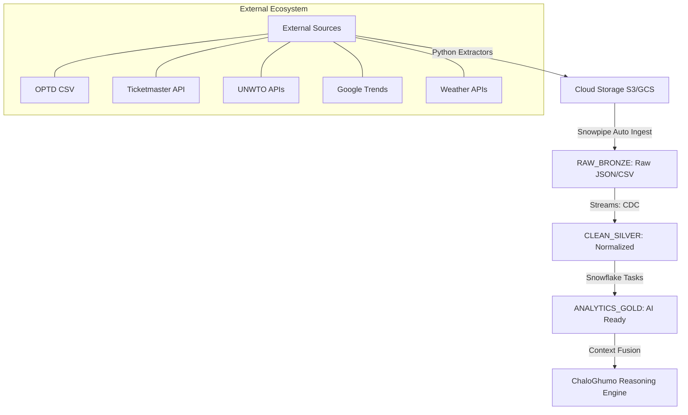

# Snowflake IaC & ETL Automation Playbook

## 1. Objective

To provide a repeatable, automated framework for provisioning Snowflake infrastructure and orchestrating the end-to-end data pipeline from external travel sources to the ChaloGhumo reasoning layer.

---

## 2. Infrastructure as Code (IaC) Strategy

We will use **Terraform** with the [Snowflake Provider](https://registry.terraform.io/providers/Snowflake-Labs/snowflake/latest/docs) to manage our analytical environment.

### A. Core Resources to Provision

- **Warehouse**: `CHALOGHUMO_WH` (Multi-cluster, Auto-scale X-Small).
- **Database**: `CHALOGHUMO_DB`.
- **Schemas**:
  - `RAW_BRONZE`: Landing zone for raw files/JSON.
  - `CLEAN_SILVER`: Normalized relational travel signals.
  - `ANALYTICS_GOLD`: Optimized views for the `ReasoningEngine`.
- **Stages**: External Stages (S3/Azure/GCS) for ingestion from OPTD and API dumps.
- **RBAC**: Functional roles (`ETL_ROLE`, `ANALYST_ROLE`, `REASONER_ROLE`) with least-privilege access.

---

## 3. The ETL Automation Pipeline

The pipeline is designed to be "Event-Driven" where possible and "Scheduled" for historical trends.

### A. Ingestion Layer (External -> Bronze)

1. **GitHub/CSV (OPTD)**: A GitHub Action will periodically trigger a Python script to fetch the latest OPTD CSV and upload it to the Snowflake External Stage.
2. **API Sourcing (Ticketmaster/UNWTO)**: Specialized Python extractors will dump JSON payloads into cloud storage, triggering **Snowpipe** for immediate ingestion into `RAW_BRONZE`.

### B. Transformation Layer (Bronze -> Silver -> Gold)

- **Snowflake Tasks**: We will use a DAG of Snowflake Tasks to orchestrate transformations:
  - `TASK_NORMALIZE`: Parses JSON into relational tables.
  - `TASK_CALCULATE_METRICS`: Refreshes "Vibe Stability" and "Seasonality" scores in the Gold layer.
- **Streams**: Use Snowflake Streams to capture Change Data Capture (CDC) from raw tables, ensuring we only process new data.

---

## 4. Pipeline Architecture Visualization

---

## 5. Technical Phase Explanation

### Phase 1: The Extraction Layer (External -> Cloud)

- **Engine**: Python-based micro-extractors.
- **Mechanism**: Periodic GitHub Actions fetch historical trends and current API states, dumping them as timestamped `.json` or `.csv` files into a cloud bucket.

### Phase 2: The Ingestion Layer (Cloud -> Bronze)

- **Engine**: **Snowpipe**.
- **Mechanism**: An event-driven pipe listens to the cloud storage bucket. As soon as a file lands, Snowpipe ingests it into the `RAW_BRONZE` schema using a `COPY INTO` command.

### Phase 3: The Normalization Layer (Bronze -> Silver)

- **Engine**: **Snowflake Streams & Tasks**.
- **Mechanism**: A **Stream** tracks Change Data Capture (CDC) on the Bronze table. A **Task** triggers when new data appears, performing schema-on-read parsing (e.g., flattening JSON) to populate the relational `CLEAN_SILVER` layer.

### Phase 4: The Analytical Layer (Silver -> Gold)

- **Engine**: **Snowflake Tasks (DAG)**.
- **Mechanism**: High-level analytical tasks calculate the **Vibe Stability Index** and **Seasonality Alignment Scores**. These are persisted in `ANALYTICS_GOLD` as materialized views or tables optimized for point-lookups.

### Phase 5: The Reasoning Layer (Gold -> Engine)

- **Engine**: **ChaloGhumo Reasoning Engine**.
- **Mechanism**: The engine performs an asynchronous burst-retrieval against the Gold layer, injecting historical truth into the Llama-3 synthesis logic.

---

## 6. Automation Playbook (Step-by-Step)

### Phase 1: Environment Setup

1. Initialize Terraform and authenticate with Snowflake.
2. `terraform apply` to provision the Database, Schemas, and Warehouses.
3. Establish Secure Storage Integration between Snowflake and Cloud Storage (AWS/Azure).

### Phase 2: Ingestion Automation

1. Configure **Snowpipe** with `AUTO_INGEST = TRUE` to listen to cloud storage notifications.
2. Deploy GitHub Actions for the "Extractor" scripts that pull from OPTD and Google Trends.

### Phase 3: Transformation Logic

1. Deploy SQL DDL for Silver/Gold tables and views.
2. Enable the **Task DAG** to run transformations on a daily/weekly cadence (depending on data source volatility).

---

## 5. Failure Recovery & Monitoring

- **Error Notification**: Configure Snowflake **Error Integration** to send alerts via SNS/Slack if a Task or Pipe fails.
- **Validation Jobs**: Weekly "sanity checks" to ensure row counts in Postgres (Operational) and Snowflake (Analytical) remain synchronized for key IATA codes.

---
**Status**: Outline Defined.
**Next Step**: Implementation of Terraform configuration files (`main.tf`, `variables.tf`).
