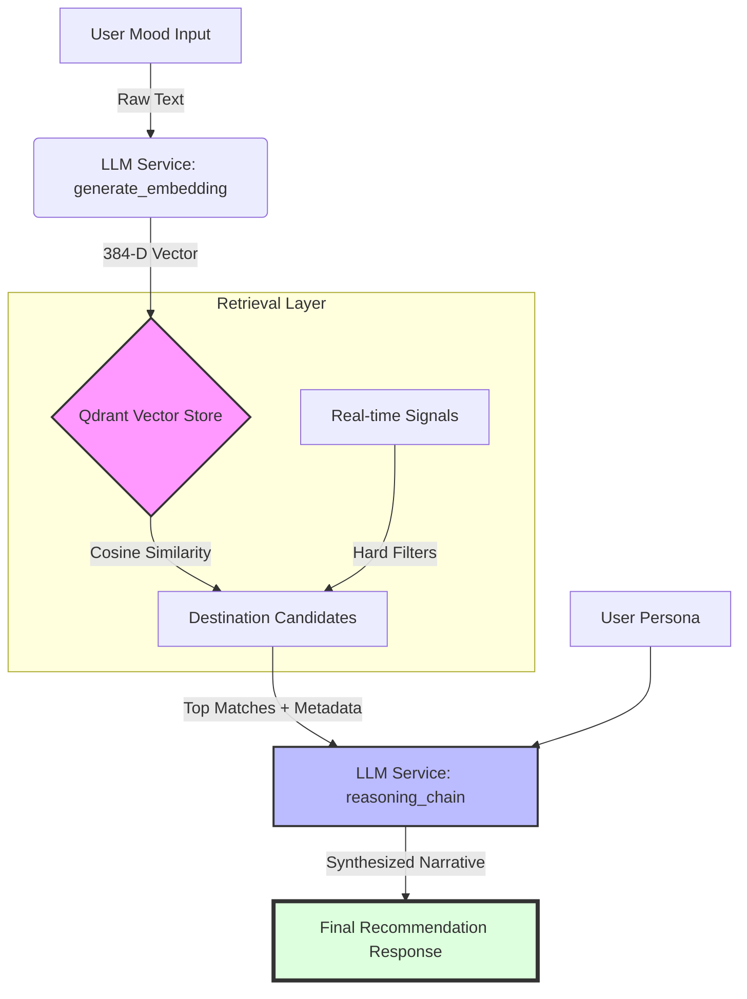

# Vector Strategy & Semantic Search Design

## Overview

This document outlines the architectural decisions for the ChaloGhumo vector storage and semantic search layer, transitioning from Sprint 1 (placeholders) to Sprint 2 (production-ready implementation).

## 1. Vector Database: Qdrant

We have selected **Qdrant** as our primary vector database.

### Rationale

- **Performance**: High-performance Approximate Nearest Neighbor (ANN) search.
- **Payload Filtering**: Crucial for travel recommendations where we need to combine semantic "vibes" with hard constraints (e.g., price range, weather, visa requirements).
- **Scalability**: Native support for distributed deployments and snapshots.
- **Distance Metric**: We use **Cosine Similarity** (`models.Distance.COSINE`), which is the standard for text embeddings and focuses on the orientation of vectors rather than their magnitude.

---

## 2. Embedding Model: SentenceTransformers (`all-MiniLM-L6-v2`)

We use a local embedding model to convert natural language descriptions into high-dimensional vectors.

### Model Rationale

- **Local Execution**: No API keys required and zero latency from external network calls.
- **Efficiency**: `all-MiniLM-L6-v2` is a highly optimized model that provides a great balance between speed and semantic accuracy.
- **Multilingual Support**: Supports 50+ languages, essential for a global travel platform.

---

## 3. Optimum Dimensions

We have standardized on **384 dimensions**.

### Why 384?

1. **Model Native**: `all-MiniLM-L6-v2` produces 384-dimensional vectors.
2. **Reduced Storage**: 50% reduction in storage and memory usage compared to 768-D models without significant loss in retrieval performance for short travel descriptions.
3. **High Density**: 384 dimensions are more than sufficient to distinguish between thousands of destination "vibes".

---

## 4. Semantic Search Mechanism

The search flow is as follows:

1. **Intent Extraction**: Raw user mood strings (e.g., "I want something peaceful with mountains but not too cold") are passed to `LLMService.generate_embedding`.
2. **Vector Generation**: The model generates a 768-D vector representing the query.
3. **Similarity Search**: Qdrant performs a cosine similarity search against the `destinations` collection.
4. **Contextual Filtering**: If specified, metadata filters (e.g., `budget < 2000`) are applied during the vector search (Pre-filtering) to ensure the results are both semantically relevant and practically viable.
5. **Score Thresholding**: Results are ranked by their similarity score (0.0 to 1.0).

## 5. Implementation Status

- [x] Qdrant Client Integration (`services/vector_store.py`)
- [x] Gemini Embedding Pipeline (`services/llm.py`)
- [x] Collection Auto-initialization logic
- [x] 768-D Dimension Standardization

---

## 6. Use Case Demo: "The Solitary Mountain Seeker"

### Scenario

A user provides the following mood input:

> *"I'm looking for a quiet place in the mountains where I can write, with cool weather but not freezing, and far from the tourist crowds."*

### Step 1: Vectorization

The `LLMService` sends this string to `all-MiniLM-L6-v2`. The resulting 384-D vector captures the semantic clusters for:

- `Isolation/Quiet`
- `Mountainous Terrain`
- `Moderate Cool Temperate`
- `Anti-Tourism/Off-beat`

### Step 2: Vector Search & Filtering

Qdrant performs a similarity search.

- **Top Match**: *Spiti Valley, India* (Score: 0.92)
- **Hard Filter Applied**: `altitude > 2000m` AND `current_temp > 5°C` AND `crowd_index < 0.3`.

### Step 3: LLM Synthesis Integration

The top result (Spiti Valley) along with its metadata (current weather, local events, safety signals) is passed to Gemini Pro.

**Prompt Construction (Internal Logic):**

```text
User Persona: Solitary writer seeking quiet mountains.
Recommended Destination: Spiti Valley.
Reasoning Data: 
- Matching Score: 92%
- Current Signal: High tranquility, 12°C.
Task: Explain why this matches the user's soul-state.
```

---

## 7. System Architecture Diagram


