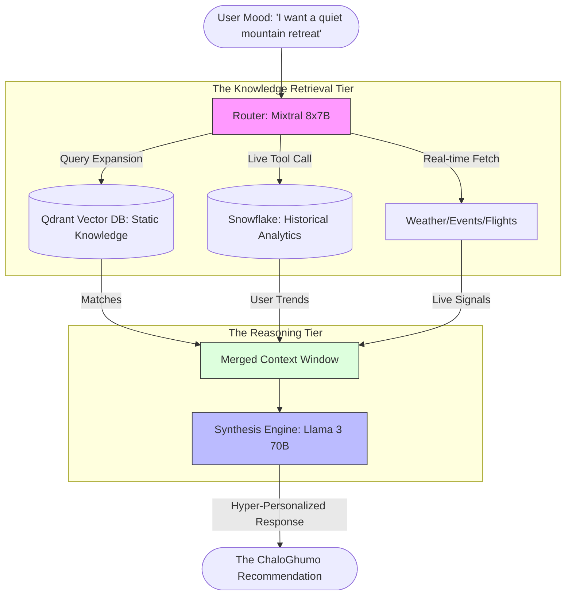

# ChaloGhumo: The Future of Intelligence-Driven Travel

## High-Performance RAG Architecture with Together AI

---

## 1. What is RAG? (The Foundational Concept)

**RAG** stands for **Retrieval-Augmented Generation**.

In simple terms, think of a standard AI (like a generic LLM) as a student taking an exam from memory. They are smart, but they might forget specific details or rely on outdated information.

**RAG** gives that student an **open-book exam**. Before answering a question, the AI:

1. **Retrieves**: Searches through a massive "library" of private or real-time data (our Qdrant Vector Store).
2. **Augments**: Adds that specific information (weather in Spiti, flight prices, hotel availability) to its memory.
3. **Generates**: Writes a response based on both its core intelligence and the fresh data it just found.

### Why RAG for ChaloGhumo?

Travel is dynamic. A static AI might know that Paris is romantic, but it doesn't know that it's raining in Paris *today*, or that there's a metro strike, or that a specific boutique hotel just opened. RAG allows ChaloGhumo to be **factually accurate and real-time**.

---

## 2. Our Vision: The Epistemic Travel Concierge

We aren't building just another "booking site." We are building a **Reasoning Engine** that understands the "why" behind travel.

### How We Beat the Competition

| Feature | Legacy Players (Expedia/Airbnb) | The ChaloGhumo Edge |
| :--- | :--- | :--- |
| **Search Logic** | Rigid Filters (Price, Location) | Semantic "Mood" Matching (Vibes, Soul-state) |
| **Information** | Often Stale/Static | Live Signal Ingestion (Weather, Events, Crowds) |
| **Reasoning** | None (User does the work) | Transparent Reasoning Chains (We explain *why*) |
| **Latency** | High (Page refreshes/Slow APIs) | **Together AI Ultra-Low Latency** (< 2s) |

---

## 3. The "No-Competition" Moat: Together AI Integration

To achieve our vision, we leverage **Together AI** for its industry-leading inference speeds and model flexibility.

### Model Selection Rationale

We use a **Triage & Execute** strategy to maximize speed without sacrificing depth.

* **The Analyst & Router (Mixtral 8x7B)**:
  * **Why**: Mixtral is a Mixture-of-Experts (MoE) model. It is incredibly fast and excels at **routing** and **function calling**. It acts as our "Brain's Frontal Lobe," deciding which tools to call and how to structure the search.
* **The Synthesis Engine (Llama 3 70B)**:
  * **Why**: Llama 3 70B is currently the gold standard for open-source reasoning. It provides the "Poetic Depth" and "Logical Synthesis" required to turn raw data into a narrative that resonates with a traveler's persona.

---

## 4. Architectural Blueprint

### High-Level Information Flow

### Leveraging Snowflake for Enterprise Scaling

While Qdrant handles our "semantic vibes," **Snowflake** acts as our **Long-Term Memory and Analytics Vault**.

* **Historical Pattern Matching**: Analyzing millions of past travel trends to predict future "hotspots" before they become crowded.
* **Deep Personalization**: Storing anonymized user behavior at scale to refine our recommendation weights over months, not just minutes.
* **Data Lake Integration**: Snowflake allows us to ingest massive third-party datasets (global flight patterns, climate change models) to provide superior "Epistemic Verification."

---

## 5. Performance Benchmarks (The Speed Moat)

A great recommendation is useless if it takes 10 seconds to load. We target **"Perceptual Immediacy"**:

* **Analyst Routing**: < 400ms
* **Vector Search (Qdrant)**: < 100ms
* **Synthesis Generation**: < 1000ms (Streamed)
* **Total Loop**: **~1.5 seconds**

*Standard competitors (GPT-4 based) typically range from 6-12 seconds.*

---

## 6. Implementation Strategy

1. **Phase 1 (Signal Ingestion)**: Map all external APIs to Together AI Function Calling schemas.
2. **Phase 2 (Hybrid Store)**: Connect Qdrant for vibes and Snowflake for historical validation.
3. **Phase 3 (Persona Engine)**: Fine-tune Llama 3 70B on travel narratives to ensure a premium, expert tone.

---

> [!IMPORTANT]
> **Status**: *Internal Design Strategy - Sprint 4 Integration*  
> **Target**: Sub-2s Reasoning Latency  
> **Moat**: Together AI Inference Speed + Snowflake Predictive Analytics  
