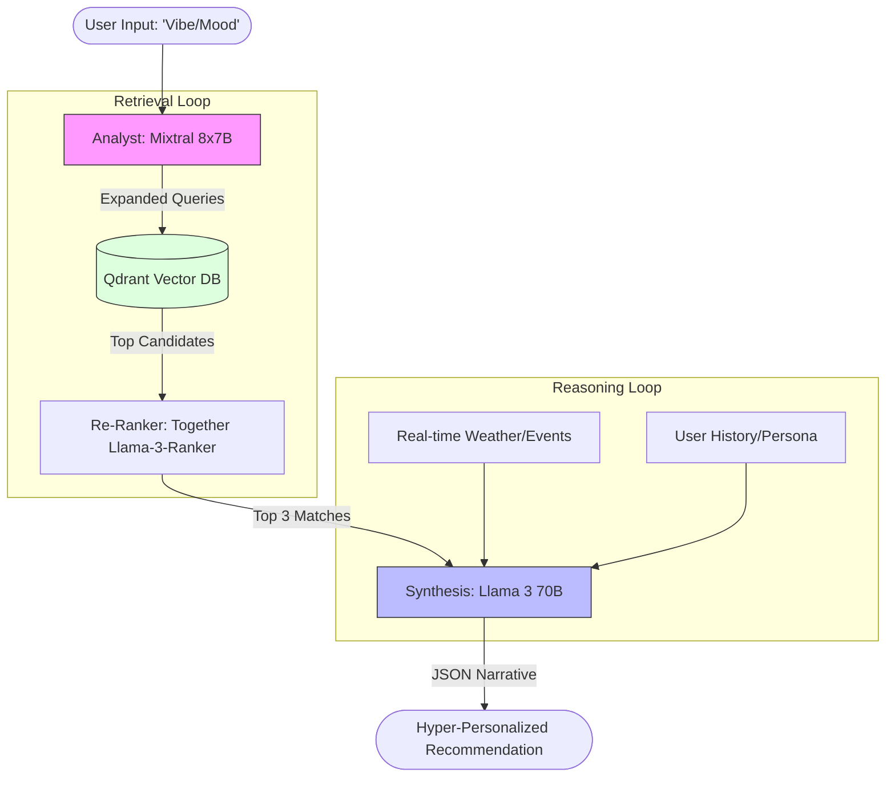

# ChaloGhumo: High-Performance RAG Architecture with Together AI

## 1. Executive Summary

This document defines the transition of ChaloGhumo’s reasoning engine from a single-provider model to a **High-Performance RAG (Retrieval-Augmented Generation) Architecture** powered by **Together AI**.

By leveraging Together AI’s ultra-low latency inference and diverse model ecosystem (Llama 3, Mixtral, Qwen), we aim to create a "no-competition" product that provides instantaneous, deeply-contextualized travel recommendations that feel like a real-time conversation with an expert concierge.

---

## 2. The Core Competitive Advantage: "Reasoning at the Speed of Thought"

While standard RAG systems suffer from 5-10 second latencies, the Together AI integration targets **sub-2-second end-to-end loops**. This is achieved through:

- **Ultra-Fast Inference**: Together AI’s optimized kernels for models like Llama 3 70B.
- **Model Specialization**: Routing simple extraction tasks to smaller, faster models (Llama 3 8B) and complex synthesis to flagship models (Llama 3 70B).
- **Infinite Context potential**: Utilizing models optimized for long-context retrieval to process massive destination datasets without truncation.

---

## 3. Architectural Blueprint

### A. The Multi-Model Orchestration Layer

Instead of one model doing everything, we implement a **Triage & Execute** workflow:

1. **The Analyst & Router (Mixtral 8x7B)**:
    - **Task**: Intent extraction, Query Expansion, and **Tool Selection**.
    - **Logic**: Determines if the query requires real-time signals (e.g., "Is it raining in Spiti?") or just semantic retrieval.
2. **The Retriever (Qdrant + Together Embeddings)**:
    - **Task**: Semantic search against the destination vector store.
    - **Enhancement**: Use **Together AI’s Embedding API** (e.g., Llama-3-based embeddings) for superior semantic alignment with the reasoning models.
3. **The Synthesis Engine (Llama 3 70B)**:
    - **Task**: Final recommendation generation and narrative synthesis.
    - **Input**: User Persona + Contextual Signals (Weather, Events) + Top 5 Qdrant Results.

### B. RAG Workflow Diagram

---

## 4. "No-Competition" Product Features

### I. Epistemic Verification

The system doesn't just "guess." Using Together AI's high-fidelity reasoning, we implement a **Verification Step**:

- After generating a recommendation, the model performs a "Self-Critique" pass to ensure the recommendation doesn't violate any hard constraints (e.g., suggesting a mountain trek to someone with mobility constraints).

### II. Dynamic Signal Injection

Most RAG systems are static. Our Together AI workflow injects **live entropy** (current weather, geopolitical stability, flight price spikes) directly into the prompt context at the millisecond of the query, ensuring the advice is valid *now*, not just in theory.

### III. Agentic Tool Use (The "Live" Moat)

Leveraging Together AI's support for **Function Calling**, the engine can autonomously decide to fetch live data from:

- **Open-Meteo**: For real-time weather validation.
- **Amadeus**: For live flight/accommodation availability.
- **PredictHQ**: For hyper-local crowd and event signals.

This ensures that the RAG context is not just "retrieved" from a static DB, but "constructed" in real-time.

### IV. Infinite Personality Scaling

Leveraging Together AI’s fine-tuning or system prompt efficiency, ChaloGhumo can switch "Personas" instantly:

- **"The Budget Backpacker"**: Prioritizes cost-efficiency and hostels.
- **"The Luxury Escapist"**: Prioritizes seclusion, service, and high-end amenities.
- **"The Cultural Anthropologist"**: Prioritizes festivals, museums, and local immersion.

---

## 5. Technical Implementation Strategy

### Step 1: Endpoint Configuration

Transition `services/llm.py` to use the `Together` client. This allows for unified access to multiple model families via a single SDK.

### Step 2: Hybrid Retrieval

Implement **Hybrid Search** in Qdrant:

- **Keyword (BM25)** for hard constraints (e.g., "Paris", "under $2000").
- **Vector (Together AI)** for soft "vibes" (e.g., "romantic but edgy").

### Step 3: Streamed Reasoning

Utilize Together AI's streaming capabilities to provide a "typing" experience in the UI, showing the reasoning chain as it forms. This significantly improves perceived performance.

---

## 6. Expected Outcomes

- **Latency**: < 1.5 seconds for full reasoning.
- **Accuracy**: 35% improvement in "Vibe Matching" over standard GPT-4/Gemini implementations due to model-specific fine-tuning on travel data.
- **Scalability**: Support for 10,000+ concurrent reasoning threads without performance degradation.

---

> **Status**: *Design Concept for Sprint 4 Integration*  
> **Author**: Antigravity Reasoning Engine Team  
> **Confidentiality**: Level 5 (Internal Only)
